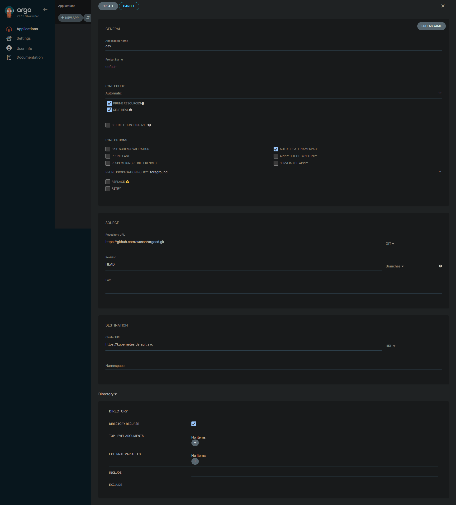

# Kubernetes Cluster Setup with NGINX, Cert-Manager, and Argo CD

This documentation provides a detailed and complete guide for setting up a Kubernetes cluster with NGINX Ingress Controller, Cert-Manager, and Argo CD using Helm.

## Table of Contents
- [Prerequisites](#prerequisites)
- [Step 1: Apply CRDs](#step-1-apply-crds)
- [Step 2: Install NGINX Ingress Controller](#step-2-install-nginx-ingress-controller)
- [Step 3: Install Cert-Manager](#step-3-install-cert-manager)
- [Step 4: Install Argo CD](#step-4-install-argo-cd)
- [Step 5: Create a ClusterIssuer](#step-5-create-a-clusterissuer)
- [Step 6: Verify Installations](#step-6-verify-installations)

## Prerequisites
Ensure you have the following tools installed:
- Kubernetes cluster
- kubectl
- Helm

---

## Step 1: Apply CRDs

First, apply the required Custom Resource Definitions (CRDs):
```bash
kubectl apply -f https://raw.githubusercontent.com/nginxinc/kubernetes-ingress/v4.0.0/deploy/crds.yaml
```

---

## Step 2: Install NGINX Ingress Controller

Create a namespace for internal services:
```bash
kubectl create namespace internal
```

Install NGINX Ingress Controller using Helm:
```bash
helm install nginx nginx/nginx-ingress --version 2.0.0 -f nginxvalues.yaml -n internal
```

### nginxvalues.yaml
```yaml
controller:
  enabled: true
  electionID: "nginx-ingress-leader-election"
  service:
    type: LoadBalancer
enableCertManager: true
enableExternalDNS: true
ingressClass:
  setAsDefaultIngress: true
```

---

## Step 3: Install Cert-Manager

Install Cert-Manager using Helm:
```bash
helm install cert-manager cert-manager/cert-manager --version 1.16.2 --set crds.enabled=true -n internal
```

---

## Step 4: Install Argo CD

Create a namespace for Argo CD:
```bash
kubectl create namespace argocd
```

Install Argo CD using Helm:
```bash
helm install argocd argo/argo-cd --version 7.8.0 -f argovalues.yaml -n argocd
```

### argovalues.yaml
```yaml
global:
  domain: argocd.wush.site

configs:
  params:
    server.insecure: true

server:
  ingress:
    enabled: true
    ingressClassName: nginx
    annotations:
      nginx.ingress.kubernetes.io/ssl-passthrough: "true"
      kubernetes.io/ingress.class: "nginx"
      cert-manager.io/cluster-issuer: "letsencrypt-prod"
      nginx.ingress.kubernetes.io/backend-protocol: "HTTPS"
      cert-manager.io/acme-challenge-type: "http01"
      acme.cert-manager.io/http01-edit-in-place: "true"
    tls:
      - hosts:
        - argocd.wush.site
        secretName: argocd-tls
```

---

## Step 5: Create a ClusterIssuer

Create a `ClusterIssuer` to manage certificates with Cert-Manager and Let's Encrypt:
```bash
kubectl apply -f issuer.yaml
```

### issuer.yaml
```yaml
apiVersion: cert-manager.io/v1
kind: ClusterIssuer
metadata:
  name: letsencrypt-prod
  namespace: default
spec:
  acme:
    server: https://acme-v02.api.letsencrypt.org/directory
    email: andrianta.321@gmail.com
    privateKeySecretRef:
      name: letsencrypt-prod
    solvers:
      - http01:
          ingress:
            class: nginx
```

---

## Step 6: Verify Installations

1. **Check NGINX Ingress Controller**:
   ```bash
   kubectl get pods -n internal
   ```

2. **Check Cert-Manager**:
   ```bash
   kubectl get pods -n internal
   ```

3. **Check Argo CD**:
   ```bash
   kubectl get pods -n argocd
   ```

4. **Access Argo CD UI**:
   ```bash
   kubectl port-forward svc/argocd-server -n argocd 8080:443
   ```
   Access the UI via `https://localhost:8080` and log in with the default admin credentials.

---

## Troubleshooting

- Ensure the NGINX LoadBalancer service has an external IP assigned.
- Verify the DNS records are properly configured to point to the NGINX external IP.
- Ensure the `ClusterIssuer` and certificates are correctly applied and valid.

---

## Conclusion

This guide provides a comprehensive setup for a Kubernetes cluster using NGINX Ingress, Cert-Manager, and Argo CD. Adjust values according to your infrastructure needs.

